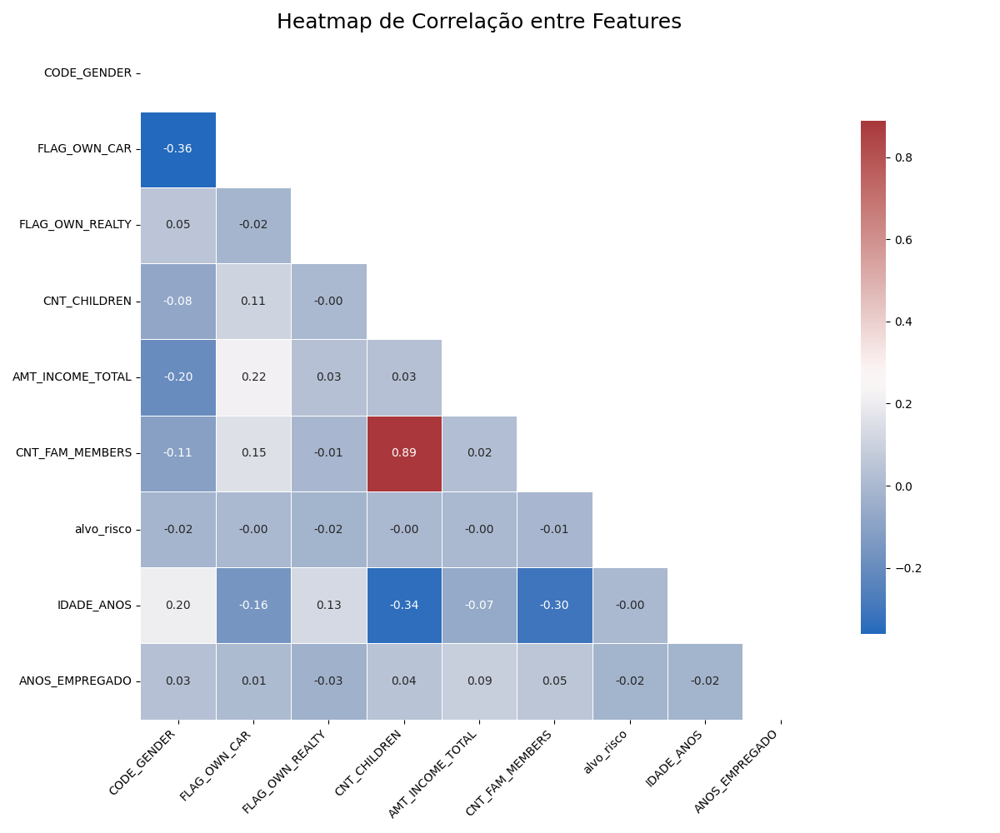
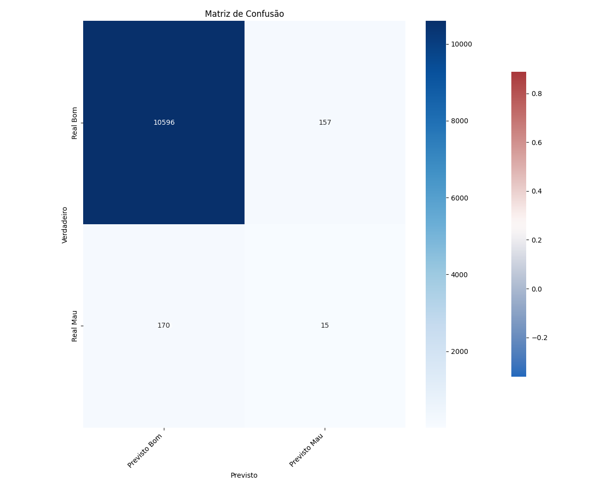

# Análise de Risco de Crédito e Previsão de Inadimplência com Machine Learning

## 1. Contexto e Problema de Negócio

Instituições financeiras enfrentam o desafio constante de avaliar o risco ao conceder crédito. Uma avaliação imprecisa pode levar a perdas significativas devido à inadimplência (default), enquanto uma avaliação excessivamente rigorosa pode resultar na perda de bons clientes.

Este projeto tem como objetivo desenvolver um modelo de Machine Learning que auxilie na tomada de decisão para a aprovação de cartões de crédito. O modelo visa classificar os solicitantes em duas categorias: **bom pagador** (baixo risco) e **mau pagador** (alto risco), com base em seus dados cadastrais e histórico de crédito.

## 2. Fonte dos Dados

Os dados utilizados foram obtidos do dataset [Credit Card Approval Prediction](https://www.kaggle.com/datasets/rikdifos/credit-card-approval-prediction) disponível no Kaggle. O conjunto de dados é dividido em dois arquivos:

* `application_record.csv`: Contém as informações cadastrais dos solicitantes.
* `credit_record.csv`: Contém o histórico mensal do status de pagamento de cada cliente.

Um dos principais desafios iniciais foi a **criação da variável alvo**, que envolveu a análise do histórico de pagamentos para classificar cada cliente como inadimplente ou não.

## 3. Análise Exploratória de Dados (EDA)

A análise inicial dos dados revelou dois pontos cruciais que direcionaram a modelagem:

### Desbalanceamento de Classes

A análise da nossa variável alvo (`alvo_risco`) demonstrou um forte desbalanceamento entre as classes. Apenas **1.7%** do total de clientes no dataset foram classificados como "maus pagadores". Este é um cenário comum em problemas de fraude e risco, e requer atenção especial, pois um modelo treinado nestes dados pode facilmente ignorar a classe minoritária.

### Correlação entre Features

Para entender a relação entre as variáveis, foi gerado um heatmap de correlação com as principais features numéricas.



O heatmap ajudou a identificar relações esperadas, como a forte correlação positiva entre o número de filhos (`CNT_CHILDREN`) e o número de membros na família (`CNT_FAM_MEMBERS`).

## 4. Metodologia e Pré-processamento

O fluxo de trabalho para a construção do modelo seguiu as seguintes etapas:

1.  **Engenharia da Variável Alvo:** A variável `alvo_risco` foi criada a partir do `credit_record.csv`. Clientes com atrasos de pagamento superiores a 60 dias (`STATUS` 2-5) em qualquer mês foram classificados como "mau pagador" (1), e todos os outros como "bom pagador" (0).

2.  **Limpeza e Tratamento de Dados:**
    * Valores nulos foram analisados. A coluna `OCCUPATION_TYPE`, com mais de 30% de dados faltantes, foi removida.
    * A coluna `ID` foi removida por não possuir valor preditivo.

3.  **Encoding de Variáveis Categóricas:** As features categóricas (como gênero, tipo de moradia, etc.) foram transformadas em formato numérico utilizando a técnica de One-Hot Encoding através do `pandas.get_dummies`.

4.  **Balanceamento de Dados (SMOTE):** Para corrigir o desbalanceamento de classes, a técnica **SMOTE (Synthetic Minority Over-sampling Technique)** foi aplicada. É crucial ressaltar que o SMOTE foi aplicado **apenas no conjunto de dados de treino** para evitar vazamento de dados (data leakage) e garantir uma avaliação realista do modelo.

5.  **Escalonamento de Features:** Todas as features foram escalonadas com o `StandardScaler` para que tivessem média 0 e desvio padrão 1. Este passo é importante para modelos sensíveis à escala dos dados, como a Regressão Logística.

## 5. Modelagem e Resultados

Como baseline inicial, foi escolhido um modelo de **Regressão Logística**. Após o treinamento com os dados balanceados e escalonados, o modelo foi avaliado no conjunto de teste (que permaneceu com a proporção original de classes).

Os resultados demonstram os desafios de se prever um evento raro:



| Métrica                 | Bom Pagador (0) | Mau Pagador (1) |
| ----------------------- | --------------- | --------------- |
| **Precision** | 0.98            | 0.09            |
| **Recall (Sensibilidade)** | 0.99            | **0.08** |
| **F1-Score** | 0.98            | 0.08            |
| **AUC Score** | \multicolumn{2}{c|}{**0.5139**}     |

A performance geral do modelo foi insatisfatória para o objetivo de negócio. O **Recall de apenas 8%** para a classe "Mau Pagador" indica que o modelo falhou em identificar 92% dos clientes de alto risco. O **AUC de 0.51** confirma que o poder de discriminação do modelo é muito próximo de um palpite aleatório.

## 6. Conclusões e Próximos Passos

O modelo de base de Regressão Logística, mesmo com o tratamento de dados desbalanceados, não foi capaz de capturar a complexidade dos padrões de inadimplência.

Este resultado, embora baixo, é um benchmark realista e fundamental que direciona os próximos passos para aprimorar a solução. As seguintes melhorias são propostas:

* **Testar Modelos Mais Robustos:** Utilizar algoritmos baseados em árvores, como **Random Forest** e **Gradient Boosting (XGBoost, LightGBM)**, que geralmente possuem um desempenho superior em dados tabulares e são menos sensíveis à escala das features.
* **Engenharia de Features Avançada:** Criar novas variáveis que possam ter maior poder preditivo (ex: razão entre renda e dívida, tempo de emprego em anos, etc.).
* **Ajuste de Hiperparâmetros:** Aplicar técnicas como `GridSearchCV` ou `RandomizedSearchCV` para encontrar a combinação ótima de parâmetros para os modelos mais complexos.
* **Analisar a Definição da Variável Alvo:** Testar outras regras de negócio para definir um "mau pagador" (ex: incluir atrasos menores, de 30 a 59 dias) e observar o impacto no desempenho do modelo.

## 7. Como Executar o Projeto

Para executar este projeto em seu ambiente local, siga os passos abaixo:

1.  **Clone o repositório:**
    ```bash
    git clone https://github.com/Jcaindami/analise-risco-credito
    cd risco_credito
    ```

2.  **Crie e ative um ambiente virtual (recomendado):**
    ```bash
    python -m venv venv
    source venv/bin/activate  # No Windows: venv\Scripts\activate
    ```

3.  **Instale as dependências:**
